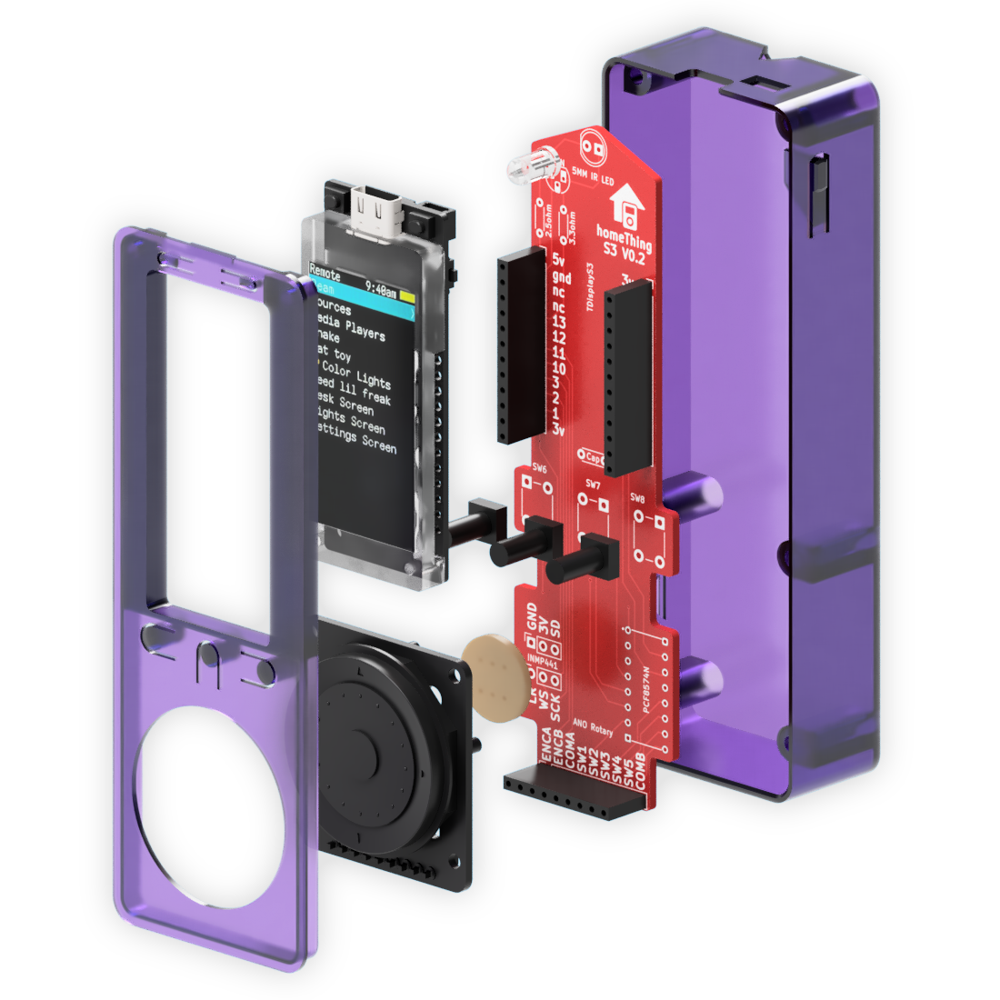

# TDisplay S3 homeThing

## Table of Contents

- [Case](#case)
- [PCB](#pcb)

## Case files

<table><tr>
<td><h2>FDM Case</h2></td>
<td><h2>SLS Case</h2>Buttons are raised on the SLS case. This requires a lot of supports on FDM</td>
</tr>
<tr>
<td>
[FDM Back Piece](fdm/s3 back fdm.stl "FDM Back Piece")
[FDM Front Piece](fdm/ s3 front fdm.stl "FDM Front Piece")
</td>
<td>
[SLS Back Piece](fdm/s3 back sls.stl "SLS Back Piece")
[SLS Front Piece](fdm/ s3 front sls.stl "SLS Front Piece")
</td>
</tr>
</table>

## PCB
<h2>[Gerber](circut>[Gerber](circut/ "Gerber")</h2>
