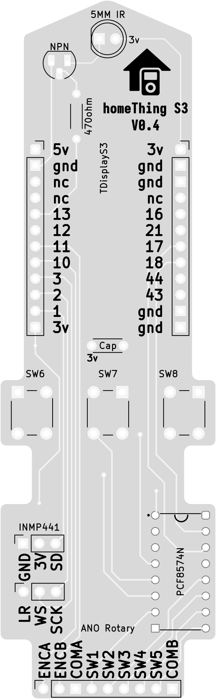
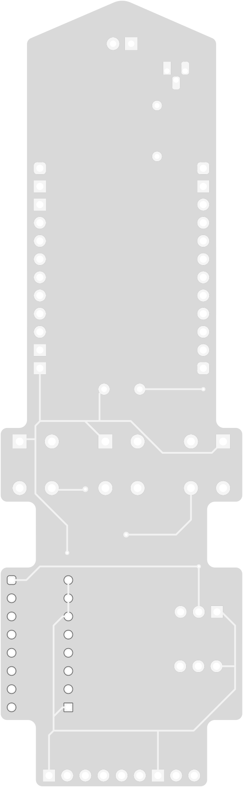

<h2>TDisplay S3 homeThing</h2>

<table>
    <tr>
        <th>TDisplay S3 homeThing Case</th>
        <th>homeThing S3 Circuit Front</th>
        <th>homeThing S3 Circuit Back</th>
    </tr>
        <td>
            
        </td>
        <td>
            
        </td>
        <td>
            
        </td>
    </tr>
</table>

<h2>Order</h2>
<a href="https://www.pcbway.com/project/shareproject/homeThing_V1_3_e3572f8f.html">Order Case from PCBWay</a> 
<a href="https://www.pcbway.com/project/shareproject/homeThing_V1_3_e3572f8f.html">Order PCB from PCBWay</a>

<h2>Case 3D Files</h2>

<table>
    <tr>
        <th>SLS Files</th>
        <th>FDM Files</th>
    </tr>
    <tr>
        <td><a href="s3 case front sls.stl">Case Front STL</a></td>
        <td><a href="s3 case front fdm.stl">Case Front FDM</a></td>
    </tr>
    <tr>
        <td><a href="s3 case back sls.stl">Case Back STL</a></td>
        <td><a href="s3 case back fdm.stl">Case Back FDM</a></td>
    </tr>
</table>

<h2>Circuit</h2>
<a href="gerber/">Gerber Files</a>

<h2>ESPHome Config</h2>
<a href="tdisplay-s3.yaml">tdisplay-s3.yaml</a>

<h2>Parts</h2>
<table>
    <tr>
        <th>Name</th>
        <th>Description</th>
    </tr>
    <tr>
        <td><a href="https://www.adafruit.com/product/5221">Custom PCB</a></td>
        <td>Custom PCB for TDisplay S3</td>
    </tr>
    <tr>
        <td><a href="https://www.lilygo.cc/en-ca/products/t-display-s3?variant=42351558590645">TDisplay S3 (Soldered Pin)</a></td>
        <td>TDisplay S3 with soldered pin</td>
    </tr>
    <tr>
        <td><a href="https://www.adafruit.com/product/5001">Adafruit ANO Directional Navigation and Scroll Wheel Rotary Encoder</a></td>
        <td>Directional navigation and scroll wheel rotary encoder</td>
    </tr>
    <tr>
        <td><a href="https://www.adafruit.com/product/5221">Adafruit ANO Rotary Navigation Encoder Breakout PCB</a></td>
        <td>Rotary navigation encoder breakout PCB</td>
    </tr>
    <tr>
        <td><a href="https://www.aliexpress.us/item/32962426410.html">INMP441</a></td>
        <td>INMP441 i2s Microphone</td>
    </tr>
    <tr>
        <td><a href="https://leeselectronic.com/en/product/71446-ic-i-o-expander-for-i2c-8bit-pcf8574p.html">PCF8574n</a></td>
        <td>GPIO extender for I2C 8-bit</td>
    </tr>
    <tr>
        <td><a href="https://leeselectronic.com/en/product/91581-91581RESISTORS14W470OHM110PCS.html">470ohm resistor</a></td>
        <td>470ohm resistor</td>
    </tr>
    <tr>
        <td><a href="https://leeselectronic.com/en/product/844-polyester-cap-50v-01uf-4pcs.html">0.1uF capacitor</a></td>
        <td>0.1uF capacitor</td>
    </tr>
</table>
