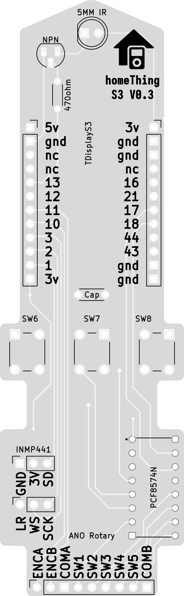

<h2>TDisplay S3 homeThing</h2>

<table>
    <tr>
        <td>
            
            
TDisplay S3 homeThing Case

        </td>
        <td>
            
            
Circuit diagram for the TDisplay S3 homeThing

        </td>
    </tr>
</table>

<h2>Order</h2>
<a href="https://www.pcbway.com/project/shareproject/homeThing_V1_3_e3572f8f.html">Order Case from PCBWay</a> 
<a href="https://www.pcbway.com/project/shareproject/homeThing_V1_3_e3572f8f.html">Order PCB from PCBWay</a>

<h2>Case 3D Files</h2>
<a href="s3 case back.stl">Case Front STL</a> 
<a href="s3 case front.stl">Case Front STL</a>

<h2>
<a href="tdisplay-s3.yaml">ESPHome Config</a>
</h2>

<h2>Parts</h2>
<ul>
<li><a href="https://www.adafruit.com/product/5221">Custom PCB</a></li>
<li><a href="https://www.lilygo.cc/en-ca/products/t-display-s3?variant=42351558590645">TDisplay S3 (Soldered Pin)</a></li>
<li><a href="https://www.adafruit.com/product/5001">Adafruit ANO Directional Navigation and Scroll Wheel Rotary Encoder</a></li>
<li><a href="https://www.adafruit.com/product/5221">Adafruit ANO Rotary Navigation Encoder Breakout PCB</a></li>
<li><a href="https://www.aliexpress.us/item/32962426410.html">INMP441 Microphone</a></li>
<li><a href="https://leeselectronic.com/en/product/71446-ic-i-o-expander-for-i2c-8bit-pcf8574p.html">PCF8574n GPIO Extender</a></li>
<li><a href="https://leeselectronic.com/en/product/91581-91581RESISTORS14W470OHM110PCS.html">470ohm resistor</a></li>
<li><a href="https://leeselectronic.com/en/product/844-polyester-cap-50v-01uf-4pcs.html">0.1uF capacitor</a></li>
</ul>
