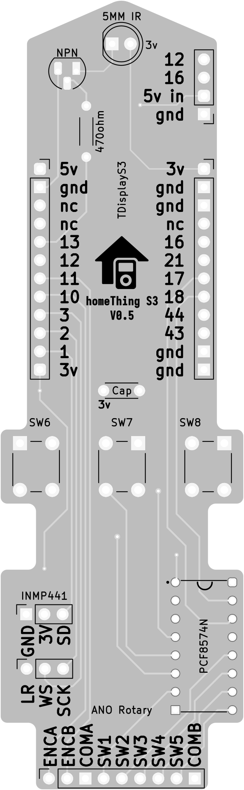
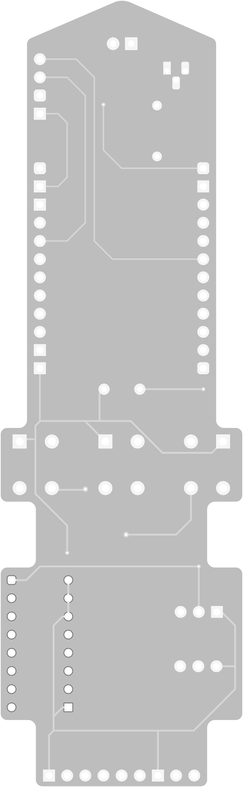

<h2>TDisplay S3 homeThing</h2>

<table>
    <tr>
        <th>TDisplay S3 homeThing Case</th>
        <th>homeThing S3 Circuit Front</th>
        <th>homeThing S3 Circuit Back</th>
    </tr>
        <td>
            
        </td>
        <td>
            
        </td>
        <td>
            
        </td>
    </tr>
</table>

<h2>Order</h2>
<a href="https://www.pcbway.com/project/shareproject/homeThing_S3_2b3ac3ac.html">Order Case and PCB from PCBWay</a>

<h2>Case 3D Files</h2>
There's a different file for for the front part FDM printers. This doesn't have extruded buttons so it can print flat without supports
<table>
    <tr>
        <th>Front</th>
        <th>Back</th>
    </tr>
    <tr>
        <td><a href="s3 case front sls.stl">s3 case front sls.stl</a></td>
        <td><a href="s3 case back.stl">s3 case back.stl</a></td>
    </tr>
    <tr>
        <td><a href="s3 case front fdm.stl">s3 case front fdm.stl</a></td>
    </tr>
</table>

<h2>Circuit</h2>
<a href="gerber/">Gerber Files</a>

<h2>ESPHome Config</h2>
<a href="tdisplay-s3.yaml">tdisplay-s3.yaml</a>

<h2>Parts</h2>
<table>
    <tr>
        <th>Name</th>
        <th>Description</th>
    </tr>
    <tr>
        <td><a href="https://www.adafruit.com/product/5221">Custom PCB</a></td>
        <td>Custom PCB for TDisplay S3</td>
    </tr>
    <tr>
        <td><a href="https://www.lilygo.cc/en-ca/products/t-display-s3?variant=42351558590645">TDisplay S3 (Soldered Pin)</a></td>
        <td>TDisplay S3 with soldered pin</td>
    </tr>
    <tr>
        <td><a href="https://www.adafruit.com/product/5001">Adafruit ANO Directional Navigation and Scroll Wheel Rotary Encoder</a></td>
        <td>Directional navigation and scroll wheel rotary encoder</td>
    </tr>
    <tr>
        <td><a href="https://www.adafruit.com/product/5221">Adafruit ANO Rotary Navigation Encoder Breakout PCB</a></td>
        <td>Rotary navigation encoder breakout PCB</td>
    </tr>
    <tr>
        <td><a href="https://www.aliexpress.us/item/32962426410.html">INMP441</a></td>
        <td>INMP441 i2s Microphone</td>
    </tr>
    <tr>
        <td><a href="https://leeselectronic.com/en/product/71446-ic-i-o-expander-for-i2c-8bit-pcf8574p.html">PCF8574n</a></td>
        <td>GPIO extender for I2C 8-bit</td>
    </tr>
    <tr>
        <td><a href="https://leeselectronic.com/en/product/91581-91581RESISTORS14W470OHM110PCS.html">470ohm resistor</a></td>
        <td>470ohm resistor</td>
    </tr>
    <tr>
        <td><a href="https://leeselectronic.com/en/product/844-polyester-cap-50v-01uf-4pcs.html">0.1uF capacitor</a></td>
        <td>0.1uF capacitor</td>
    </tr>
    <tr>
        <td><a href="https://www.aliexpress.com/item/32835179410.html">3.7V 7x20x50mm 700mAh Lipo</a></td>
        <td>3.7V 7x20x50mm 700mAh Lipo</td>
    </tr>
    <tr>
        <td><a href="https://leeselectronic.com/en/product/31231-tack-switch-6x6x10mm.html">10mm Push Button</a></td>
        <td>10mm Push Button</td>
    </tr>
    <tr>
        <td><a href="https://leeselectronic.com/en/product/6049-6049BOLTM25100PCS.html">M2.5x8mm screws</a></td>
        <td>M2.5x8mm screws</td>
    </tr>
    <tr>
        <td><a href="https://leeselectronic.com/qc/product/7174-7174TRANSISTOR2N2222MPS2222ANPN5.html">2N2222 Transistor</a></td>
        <td>2N2222 Transistor</td>
    </tr>
</table>
