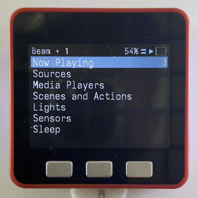
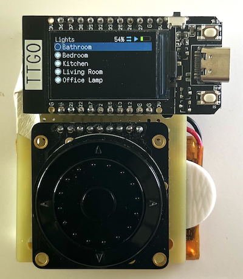
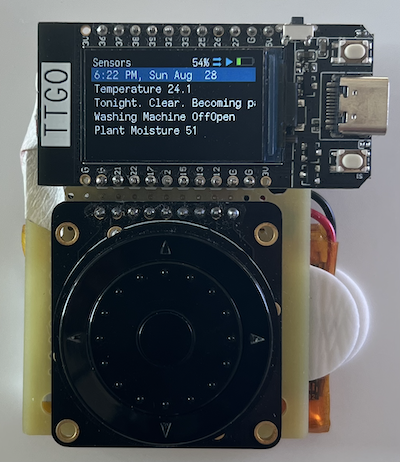
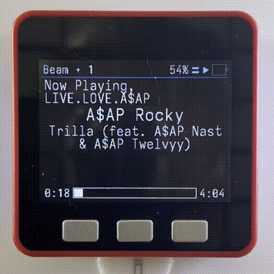

# esphome-remote
iPod style wifi smart home remote. Supports M5Stack Fire or Lilygo T-Display with Adafruit ANO Scrollwheel. Uses ESPHome and Home Assistant to integrate with Sonos, Roku and run custom scenes and scripts.

## Demo Video

## Features
### iPod classic style menu 

- #### Scroll through list and press center to select
    - With a scrollwheel the top button goes back
    - On M5Stack going up past the top of the list will go back
    - A scroll bar appears if list extends past the screen. 

- #### Header is always shown at the top with info about the current state

- #### Now Playing screen shows the current media player's state

1. Current media player + # of grouped speakers
2. Volume %
3. Shuffle state
4. Play/Pause/Stopped state
5. Battery level
6. Playlist or album title
7. Media artist
8. Media title
9. Media position and playback bar
10. Media duration
    - If the text doesn't fit then the playlist/album title will hide
    - If the text still doesn't fit the media title and media artist are truncated
    - For TVs the only information available is the current source (eg Youtube) or the power state

- #### Screen returns to now playing after display sleeps
    - Display sleeps after 10s of idle. Device sleeps after 2h of idle 💤
- #### Font size and UI size is adjustable in yaml 🔨
- #### Simple yaml configuration. all of the complicated code is included in other files ⚡️

## Media Control 🔊📺
#### 1. Control Sonos speakers
- #### Play / pause, next track, previous track, toggle shuffle and mute

- #### Scroll for volume (with scroll wheel)

- #### Manage speaker group 

- #### Change source from sonos favourites list

### 2. Control Roku tv
- Remote directional buttons up, down, left, right, select (with scroll wheel)
- Scroll for volume (with scroll wheel)
- Power, back, home, pause in second menu (with scroll wheel)
- Change source from tv source list

- Change current media player (tv or speaker) from home menu
	- On boot the current media player is the first speaker found playing music or the tv

### Smart Home Control
- #### Toggle lights on and off

- #### Run scenes and scripts
- #### View sensors from Home Assistant

## Hardware
### Lilygo T-Display with Scrollwheel
- T-Display with scrollwheel has the same interface as an ipod
	- Scroll to navigate ui and for volume on now playing
	- Up for menu, left for previous track, right for next track, down for pause, center for select
	- 2 additional buttons for home and options menu
	- Charges with usb-c
	- 900 mah battery
	- On average 3 days of battery life depending on use

### M5Stack Fire

- M5Stack Fire is supported without any additional hardware
	- Uses the 3 buttons for navigation
	- Simpler UI
	- Uses internal light for booting sequence and while on

## includes
- esphome https://esphome.io/
- Adafruit ANO Directional Navigation and Scroll Wheel Rotary Encoder https://www.adafruit.com/product/5001
- LILYGO ESP32 T-Display
- 900mah lipo https://leeselectronic.com/en/product/88341-battery-rechargeable-li-poly-37v-900mah.html
- iosevka font https://github.com/be5invis/Iosevka

## todo
- queue count
- sonos night sound / speach boost
- repeat/all/single/off
- marquee long text
- case
- photos