<h1 align = "center">ESPHome Remote ⚙️</h1>

iPod style wifi smart home remote. Uses ESPHome and Home Assistant to integrate with Sonos, Roku and run custom scenes and scripts. Supports many different hardware configurations:
- M5Stack Fire (no additional hardware)
- Lilygo T-Display T4 (no additional hardware, scrollwheel coming soon)
- Lilygo T-Display TTGO with Adafruit ANO Scrollwheel
### [Learn how to get started](GettingStarted.md)

## Demo Video 🎬

## Features 📝
### iPod classic style menu 
|t-display demo|m5stack fire demo|lilygo T4 demo|
|--|--|--|
|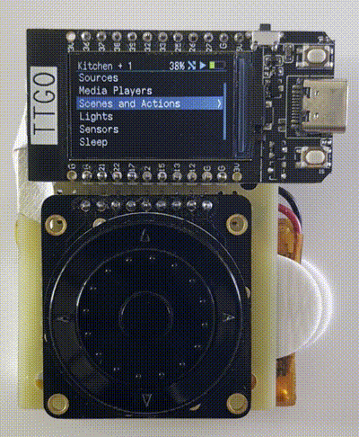|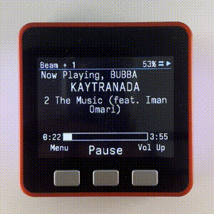|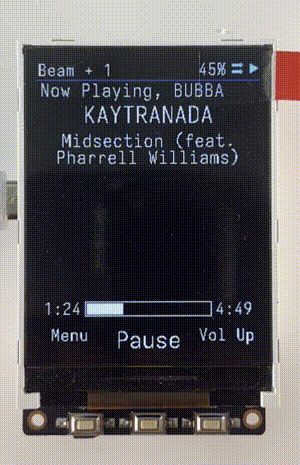

- Scroll through list and press center to select
- With a scrollwheel the top button goes back
- On M5Stack going up past the top of the list will go back
- A scroll bar appears if list extends past the screen. 
- Screen returns to now playing after display sleeps
    - Display sleeps after 10s of idle. Device sleeps after 2h of idle 💤
- Font size and UI size is adjustable in yaml 🔨
- Simple yaml configuration. all of the complicated code is included in other files 🛠
- Header is always shown at the top with info about the current state

### Now playing screen ⏯
<table>
<tbody>
<tr>
<td style="width: 50%;">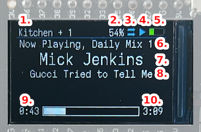</td>
<td style="width: 50%;">
<ol>
<li>Current media player + # of grouped speakers</li>
<li>Volume %</li>
<li>Shuffle state</li>
<li>Play/Pause/Stopped state</li>
<li>Battery level</li>
<li>Playlist or album title</li>
<li>Media artist</li>
<li>Media title</li>
<li>Media position and playback bar</li>
<li>Media duration</li>
</ol>
</td>
</tr>
</tbody>
</table>

## Media Control 🔊📺
### 1. Control Sonos speakers
|Play / pause, next track, previous track, toggle shuffle and mute|Scroll for volume (with scroll wheel)|
|--|--|
|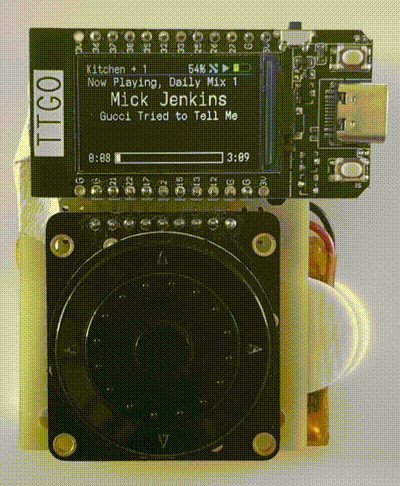|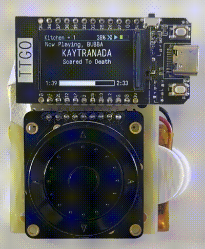|

|Manage speaker group|Change source from Sonos favourites list|
|--|--|
|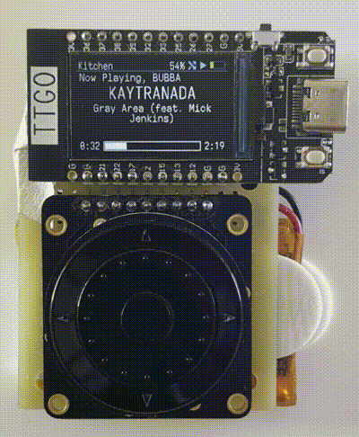|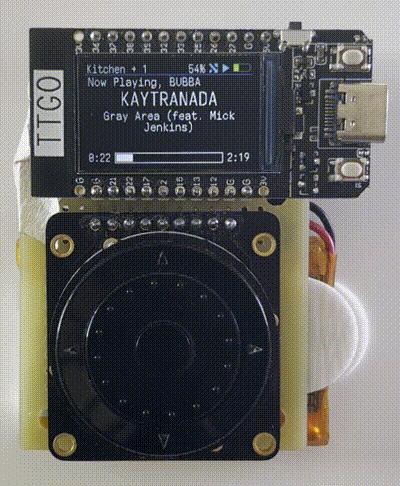|

### 2. Control Roku tv 📺
- Remote directional buttons up, down, left, right, select (with scroll wheel)
- Scroll for volume (with scroll wheel)
- Power, back, home, pause in second menu
- Change source from tv source list

- Change current media player (tv or speaker) from home menu
	- On boot the current media player is the first speaker found playing music or the tv

## Smart Home Control 🧠🏠
|Toggle lights on and off|View sensors from Home Assistant|Run scenes and scripts|
|--|--|--|
|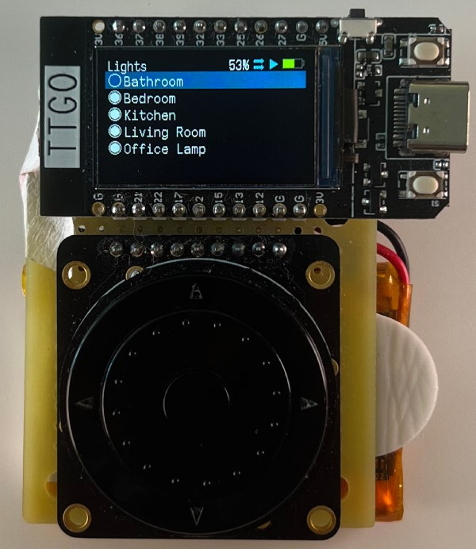|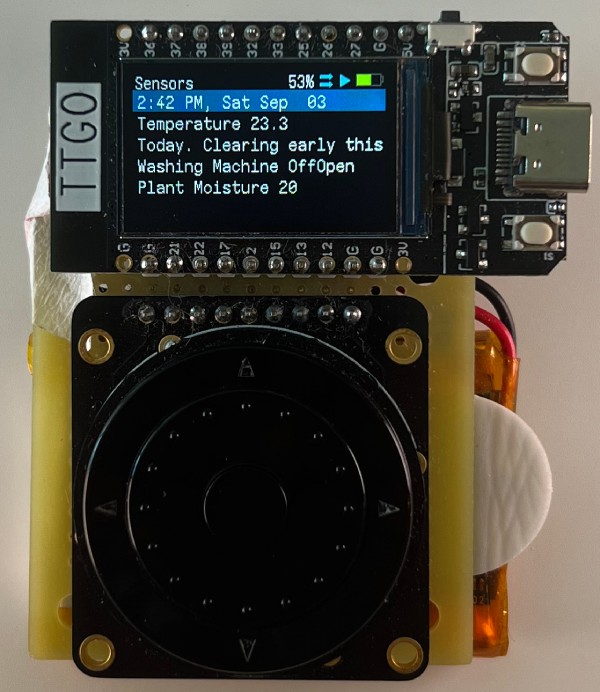|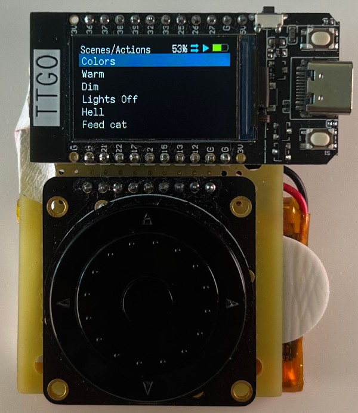|

## Hardware 
### 1. Lilygo T-Display with Scrollwheel ⚙️
#### T-Display with scrollwheel has the same controls as an ipod

|Lilygo T-Display Controls|
|--|
||

- Scroll to navigate in list menus and for volume on Now Playing Menu
- Charges with usb-c
- 1100 mah battery
- On average 3 days of battery life depending on use
	- Adafruit ANO Directional Navigation and Scroll Wheel Rotary Encoder https://www.adafruit.com/product/5001
	- Adafruit ANO Rotary Navigation Encoder Breakout PCB https://www.adafruit.com/product/5221
	- 1100mah lipo https://leeselectronic.com/en/product/88345-battery-rechargeable-li-poly-37v-1100mah-jst-zh.html

### 2. M5Stack Fire 🔥
#### M5Stack Fire is supported without any additional hardware
- https://www.mouser.ca/ProductDetail/M5Stack/K007-V26?qs=TCDPyi3sCW1MGXwu64XB7w%3D%3D
- Uses the 3 buttons for navigation
- Simpler UI
- Uses internal RGB light for booting sequence and while on

|M5Stack Fire Controls|M5Stack Fire Boot sequence|
|--|--|
|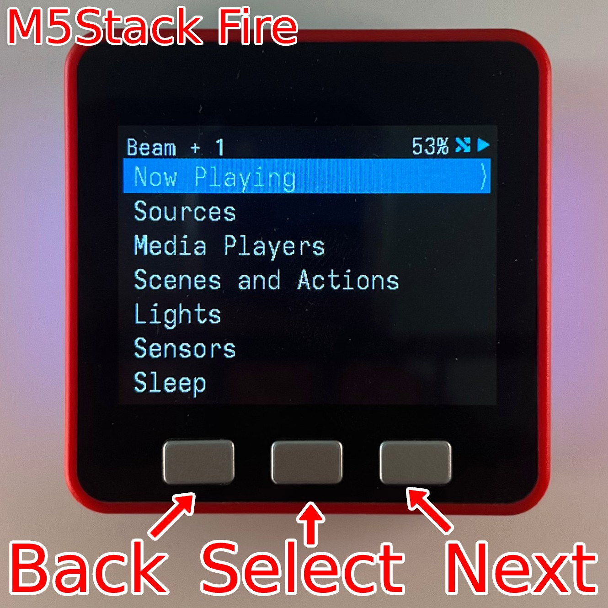|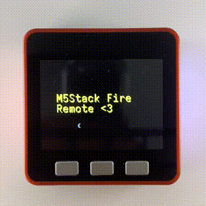|

### 3. Lilygo T-Display T4 
#### Lilygo T-Display T4 is supported without any additional hardware
- https://www.aliexpress.com/item/32854502767.html
- Uses the 3 buttons for navigation
- Simpler UI
- Scrollwheel and battery planned

|Lilygo T4 Controls|
|--|
|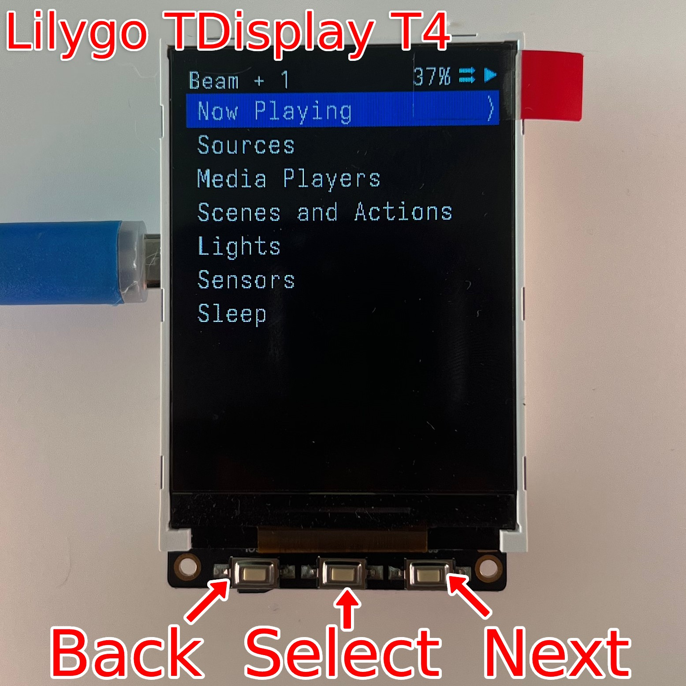|

## Mentions
- Hackaday https://hackaday.com/2022/09/08/scroll-through-esphome-with-ipod-style-click-wheel/
- Hackster https://www.hackster.io/news/ipod-style-esphome-remote-3ca38edab2b4
- Reddit post https://www.reddit.com/r/homeassistant/comments/x59dcp/i_built_an_ipod_style_esphome_remote_for_home/

## includes
- esphome https://esphome.io/
- iosevka font https://github.com/be5invis/Iosevka

## todo
- queue count
- sonos night sound / speech boost
- repeat/all/single/off
- light dimming
- weather screen
- room screen
	- temp display
	- lights
	- media player
	- hvac
- settings menu
- battery level for m5stack fire
- case
- circuit diagram for tdisplay

